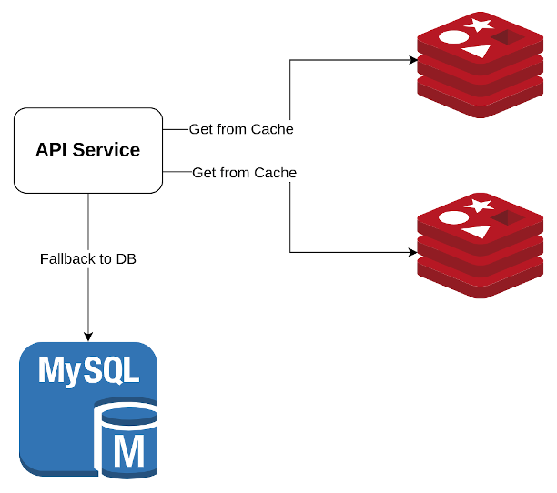

# Architecture Overview



This library developed using the **Cache-Aside Pattern**, with basic steps:

1. Data is first get from Cache Server (Redis)
2. If Data is Existed on the Cache => Returns to Client
3. If Data is NOT Existed => Get From DB => Set Back to Redis => Returns to Client

Why **Cache-Aside**?

1. Easier to implement, can do in a way that guarantees consistency under any circumstances.
2. Recommended way of Caching Things.
3. Client SHOULD use deletion to do invalidation, because it can do in a generic way by \
   using [Before Commit Hook](https://docs.sqlalchemy.org/en/13/orm/events.html#sqlalchemy.orm.events.SessionEvents.before_commit)
   and [After Commit Hook](https://docs.sqlalchemy.org/en/13/orm/events.html#sqlalchemy.orm.events.SessionEvents.after_commit)
   combining with the **Transactional Outbox Pattern**.
4. Can use the LRU Mechanism ([Redis LRU](https://redis.io/docs/reference/eviction/)) to NOT have to worry about memory
   limit

## How this Library guarantee consistency between Redis and Database

Based on [Memcache Lease](https://research.facebook.com/publications/scaling-memcache-at-facebook/) \
In order to implement this algorithm, this library used **Lua Scripting**.

With 2 Scripts Below:

### Script 1: Get Data from Cache

```
local result = {}
 
for i = 1,#KEYS do
    local k = KEYS[i]
     
    local resp = redis.call('GET', k)
     
    if resp then
        result[i] = resp
    else
        local cas = redis.call('INCR', '__next_cas')
        local cas_str = 'cas:' .. cas
        redis.call('SET', k, cas_str, 'EX', 3)
        result[i] = cas_str
    end
end
 
return result
```

Explanation:

1. The call ``redis.call('GET', k)`` get data of Redis key ``k``.
2. If key ``k`` exists, the line ``if resp then`` will evaluate to **TRUE** \
   => Returns the data stored in that key.
3. If key ``k`` does NOT exist: \
   => Increase the value inside ``__next_cas``
   through the Lua call ``redis.call('INCR', '__next_cas')``. \
   That new value will be stored inside the local variable ``cas``.
4. Set the value with format ``cas:{cas}`` to the key ``k`` with this command: \
   ```redis.call('SET', k, cas_str, 'EX', 3)'``` \
   The TTL value is 3 seconds.
5. Returns that ``cas:{cas}`` value back to the client with the line ``result[i] = cas_str``.

### Script 2: Set Data to Cache

```
local result = {}
 
for i = 1,#KEYS do
    local k = KEYS[i]
     
    local resp = redis.call('GET', k)
     
    local cas_str = 'cas:' .. ARGV[i * 3 - 2]
    local val = 'val:' .. ARGV[i * 3 - 1]
    local ttl = ARGV[i * 3]
     
    if not resp then
        result[i] = 'NF'
    elseif resp ~= cas_str then
        result[i] = 'EX'
    else
        redis.call('SET', k, val, 'EX', ttl)
        result[i] = 'OK'
    end
end

return result
```